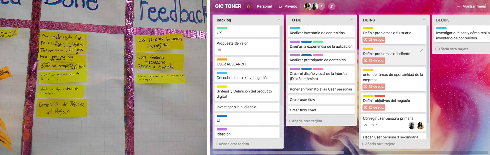
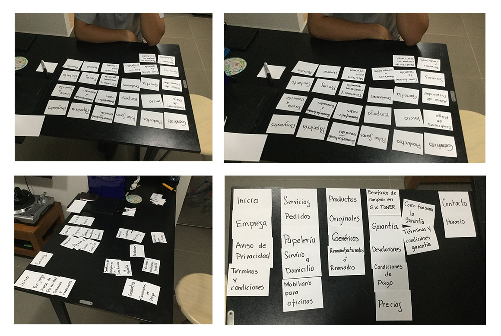

## Problema

Las pymes tienen muchos problemas para consolidarse, las unidades de negocio en México viven 7.7 años en promedio de acuerdo con el INEGI, las razones por las que una empresa tenga éxito o desaparezca son multifactoriales: la salud financiera del país donde se desarrollen, la estrategia con la que planteen su dirección de trabajo o si tienen una.

Todo diagnóstico es complejo pero es más complejo cuando no se tienen métricas iniciales, lo que pasa mucho con las pymes.

## Meta

E-commerce o  comercio electrónico es el proceso mediante el cual dos o más partes realizan una transacción de negocios a través de una computadora o dispositivo móvil y una red de acceso. El objetivo principal de aprendizaje de este proyecto es entender cómo pasamos de lo que un cliente quiere alcanzar al definición de un producto digital en poco tiempo. Entender los principales pasos y preguntas que debemos hacernos, cómo involucrar a los usuarios y su feedback, y cómo usar esos resultado sin perder la vista los objetivos iniciales.

La meta de este proyecto es entender las necesidades y áreas de oportunidad de la empresa, aprender y empezar a empaparnos de los posibles modelos de negocio así como investigar a las audiencias, los usuarios que consumen los productos entendiendo las preferencias y contexto en que lo hacen.

## Nuestro propósito

No caer en suposiciones, nuestro principal propósito en este ejercicio es brindarle a nuestro cliente soluciones basadas la profundización de nuestra investigación, el análisis de los insights obtenidos y la síntesis en implementaciones viables con los recursos actuales de nuestro cliente.

## Proceso de diseño

Nuestro método de investigación tomó como punto de partida los conceptos de **Desing Thinking** que nos brinda un mapa coherente de cómo aproximarnos a una problemática, además de que nos permite mirar hacia atrás en nuestros pasos para poder rectificar el camino.
Hay que buscar llegar al testeo y la implementación, pero no sin comprender el problema de la manera más profunda que podamos, una investigación robusta y un análisis de ésta es la columna vertebral de las soluciones por venir, si prescindimos de esta profundidad cualquier corrección a la implementación sería básicamente intentar encontrar la respuesta dentro de una caja vacía.  

También nos apoyamos en un sprint planning donde diariamente planeábamos y reflejábamos nuestros avances, temas bloqueados y estrategias a seguir para continuar con nuestros esfuerzos de entendimiento del problema.

## Entendimiento del problema

### Productos y Servicios que ofrece GIC Tóner.

GIC Tóner se especializa en la venta de tóner remanufacturado 100% garantizado con el cual sus clientes tienen un ahorro de hasta el 60% en comparación con un cartucho original.

Otros productos que ofrece a sus clientes :

* Cartuchos de tinta y tóner Compatibles.
* Consumibles Originales.
* Artículos de papelería.
* Mobiliario para oficinas.

Servicios:

* Servicio de Envío a Domicilio totalmente GRATIS.
* Servicio de Entrega Express con un costo adicional entre $50 y $100.
* Mantenimiento a impresoras.

**Beneficios de usar Tóner Remanufacturado de GIC Toner**

* Economiza utilizando productos de calidad idéntica al consumible original.
* Rompe paradigmas con productos que no dañan tu impresora.
* Ayudan al medio ambiente rehusando cartuchos que tardan más de 400 años en biodegradarse.

#### PROBLEMÁTICA A RESOLVER

* Atraer a un mayor número de clientes a través de internet.
* Disminuir el tiempo de búsqueda de nuevos clientes de manera offline y poner todos los esfuerzos en tener una mayor presencia online para llegar a esos clientes.
* Se cuenta con un sitio web informativo que se actualiza muy poco.
* Dice tener una tienda en línea pero en realidad sólo es un catálogo digital no actualizado.
* No se tienen publicados todos los tipos de productos y servicios que ofrecen.
* Aunque han recibido mensajes a través del chat y se les da seguimiento no ha sido el adecuado, haciendo que se pierdan clientes potenciales.
* Ciertos eslabones de la cadena de servicio generan desconfianza.
* No cuenta con los certificados de seguridad requeridos.

#### OBJETIVOS DE NEGOCIO

* Desestigmatizar el uso de cartuchos remanufacturados.
* Reducir el costo de tiempo y dinero en cada esfuerzo por conseguir un nuevo cliente.
* Atraer nuevos clientes.
* Generar registro de prospectos solicitando cotización de productos.
* Dar a conocer la variedad de productos y servicios que ofrece **GIC Tóner.**
* Tener visibilidad frente a los competidores.
* Retener a los clientes que ya tiene a través de una comunicación constante por medio de newsletter y/o WhatsApp.

#### METAS
**(analizar qué metas se ajustan a nuestros objetivos)**

* Objetivos de servicio al cliente: Satisfacción, referencias.
* Objetivos del producto : la difusión de las cualidades de producto.
* Objetivos de comunicación: comunicación de personalidad de la marca, gestión de la reputación, la gestión de crisis.
* Objetivos de marketing: la marca, la conciencia , el compromiso , la respuesta , generación líder.

#### OBJETIVOS UX
* Hacer que el servicio al cliente de GIC Tóner se vea reflejado en la propuesta de valor de la empresa.
* Proporcionar a los clientes y prospectos información sobre el uso confiable de cartuchos remanufacturados.
* Proporcionar a los prospectos y clientes la información de servicios y productos adicionales a los cartuchos remanufacturados.
* Compartir la experiencia del uso de cartuchos remanufacturados de clientes actuales a través de testimoniales.
* Migrar la experiencia offline de atención al cliente a online para brindar la misma atención personalizada a los usuarios nuevos

[Modelo de Negocio](https://docs.google.com/document/d/1ZpI653SXqLEvcTGCAWiWFU43xgc5bh1BFQxQF08MD5c/edit?usp=sharing)

## Descubrimiento e investigación
### Primera Entrevista con el Cliente

En esta primera entrevista buscamos conocer más a detalle cómo es la estructura de la empresa, sus productos y sus procesos, para ello desarrollamos un protocolo que nos dio una guía de lo que necesitamos saber para poder comenzar el procesos de ubicar las dolencias y detectar problemas.

[Guía para entrevista cliente](https://drive.google.com/open?id=1BBiWblK_G-skLgLjwi8Y0DMxcKxy6ngVk88NWFeVfoQ)

[Transcipción Primera Entrevista Cliente](https://drive.google.com/open?id=1mlTGSyEpSw-VhyUcgnF4gmHe79sw2E5XUHoA7j__q9k)

### Segunda Entrevista con el Cliente

El motivo de esta entrevista es platicar con la otra parte de la asociación del negocio Juliana Silva pues ella se encarga de la búsqueda de clientes y concretar ventas, por lo que nos interesa conocer sus procesos para así generar insights que puedan devenir en crear la persona usuario y su customer journey.

Fecha: 19 de agosto 2018
Duración de la primera grabación: 17 min

[Transcipción Segunda Entrevista Cliente](https://drive.google.com/open?id=1zw6u3-rAH1aebbUoBz_Rll9cvTUtdL77Mhwh5sW2qDs)

#### Insights entrevista con el cliente

1.- Comprobamos nuevamente que el fuerte de este negocio es el seguimiento de la venta y la atención personalizada al cliente.

2.- Aunque tienen claro que quieren alcanzar a las grandes oficinas o empresas, y mucho de su esfuerzo va dirigido a ello, hay más probabilidad que por el momento su mercado se limite a negocios pequeños y hogares o freelancers.

3.- Sin embargo el perfil del target es acertado ( oficinas, notarias, consultorios médicos, escuelas, agentes automotrices, agentes de viajes, similares).

4.- La meta para con cliente debe ser generar un ecommerce que los ayude a consolidarse y generar confianza en sus posibles compradores para así hacer más ágil el proceso de ventas.

5.- También recomendamos al cliente que establezca una comunicación profesional en sus redes sociales.

#### HIPÓTESIS

* La principal necesidad del cliente es generar un sentimiento de confianza, en este momento les cuesta mucho trabajo que las personas crean que su negocio existe.
* De la variedad de ecommerce que vimos en la consultoría con Mike, es probable que la lista de difusión por whatsapp les funcione ya que uno de sus principales puntos fuertes que tienen es la relación cercana con su cliente.

### Entrevista con Usuarios

Después de la información obtenida por el cliente pudimos esbozar un primer perfil de usuario y buscar individuos que cumplieran con estas características para obtener su perspectiva en cuanto al producto y servicios que ofrece GIC Toner.

[Guía para entrevista usuarios](https://drive.google.com/open?id=1BGC9VQ6qAvL7ctkC-pfeVFE9OJbSGO1WWB97m8TBoM0)

[Transcipción entrevistas usuarios](https://drive.google.com/open?id=1z4isjIAOpzccIR7eaKp34juUJPLZ0YJ0EmEP6tPX20k)

### Insights Entrevistas Usuarios

* Comprar cartuchos genéricos o remanufacturados reduce en gran porcentaje los costos.
* A pesar de que los cartuchos genéricos o remanufacturados no rinden la misma cantidad de impresiones, es más económico comprar 2 cartuchos que uno original.
* Hemos probado cartuchos remanufacturados y ese cartucho fue el que mayor rendimiento tuvo.
* Tenían el tóner que necesitábamos con entrega inmediata cuando los cartuchos originales tardaban 6 semanas en entregarlo.
* Todas las empresas están buscando actualmente bajar costos de muchas maneras, en este caso en la cantidad de impresiones y la calidad del servicio también debe ser buena.
* Creo que cualquier accesorio o pieza que sea remanufacturada siempre y cuando tenga una garantía y veamos que sí funciona el ahorro sería beneficioso en cuanto a la adquisición de esa compra.
* Creo que todos es lo que buscamos, como dicen bueno, bonito y barato.
* Hay veces que se necesita la entrega inmediata que es lo que muchos proveedores no cuentan.
* Casi siempre en una empresa urge para el día de ayer, entonces eso es lo que tomaría en cuenta, incluso entrega a deshoras porque hay veces que ses les acaba y tienen que sacar la chamba.

### Insights del Negocio
1.- Comprobamos nuevamente que el fuerte de este negocio es el seguimiento de la venta y la atención personalizada al cliente.

2.- Aunque tienen claro que quieren alcanzar a las grandes oficinas o empresas, y mucho de su esfuerzo va dirigido a ello, hay más probabilidad que por el momento su mercado se limite a negocios pequeños y hogares o freelancers.

3.- Sin embargo el perfil del target es acertado ( oficinas, notarias, consultorios médicos, escuelas, agentes automotrices, agentes de viajes, similares).

4.- La meta para con cliente debe ser generar un ecommerce que los ayude a consolidarse y generar confianza en sus posibles compradores para así hacer más ágil el proceso de ventas.

5.- También recomendamos al cliente que establezca una comunicación profesional en sus redes sociales.

6.- Gracias a su atención personalizada el cliente ha podido descubrir que la mayor falla de su competencia es su inconstancia y pésimo seguimiento al usuario.

## Investigación sobre el producto

#### Qué se entiende por cartuchos originales, compatibles y remanufacturados
> Se entiende por cartuchos compatibles aquellos en los que de todo lo que le compone es totalmente nuevo, incluido carcasas, tornillería y engranajes. Por tanto se trata de un producto nuevo y que tiene un aspecto diferente al del consumible original.
Los cartuchos reciclados, también llamados remanufacturados,  son aquellos que partiendo de  cartuchos originales vacíos son sometidos a un proceso de desmontaje, limpieza, sustitución de componentes, sellado, rellenado, montaje y control final de impresión. Se usan tóner/tinta específicas para cada modelo y todos los componentes mecánicos y eléctricos que desarrollan la impresión previa son sustituidos por componentes totalmente nuevos. Normalmente lo único que se reutiliza son las carcasas exteriores (dependiendo de su estado), tornillería y engranajes.
Un cartucho original es aquel que está fabricado bajo la marca del fabricante original, por tanto lleva su sello y no ha sido fabricado por la marca.

[Compatibles y reciclados VS Originales](http://www.ahorraentinta.com/blog/blog-toner/compatibles-y-reciclados-versus-originales/)

#### Toner original contra compatible
> Muy pocas empresas se preocupan de sustituir las piezas de desgaste de los toners, que las tienen, simplemente rellenan, y claro, luego vienen los problemas.
[Toner original VS toner compatible
](https://www.mur3.com/toner-original-vs-toner-compatible)

#### Infografía HP
[Infografía: descubriendo los problemas del tóner no original
](https://www.muycomputer.com/2015/10/29/infografia-descubriendo-los-problemas-del-toner-no-original/)

### Benchmark comparativo ventajas y desventajas tipos de toner

## Proceso creación User Persona

Para la creación de nuestro User Persona comenzamos con una lluvia de ideas basado en lo que detectamos en las entrevistas a usuarios, en las que identificamos cuáles son sus necesidades, miedos y deseos.

#### Mapa de empatía

#### User Persona
La persona la construimos con base a las entrevistas con nuestro cliente y entrevistas con usuarios potenciales. Cabe destacar que gracias al contacto tan directo que genera el servicio a cliente de GIC Tóner con el usuario,  nos pudieron proporcionar gran cantidad de detalles y datos muy coherentes y precisos sobre cómo se comportan y cuáles son sus paint points.

Después de esta entrevista con el cliente y su socia (vendedora) pudimos obtener datos concretos sobre el proceso de compra, los dolores tanto de las vendedoras como de los usuarios no sólo en cuanto al servicio de GIC Tóner, sino también en cuanto a sus experiencias negativas previas con otros proveedores.

### Costumer Journey

### Insights de este proceso

* Requiere mucho tiempo, dinero y energía hacer una conversión.
* Las vendedoras son agentes activos dentro del flujo de la venta.
* La experiencia del usuario es muy placentera ya que es un cliente asiduo pero muy dolorosa cuando es un cliente nuevo pues está lleno de incertidumbres.
* La mayoría de los procesos son OFF Line.

_________________________________________________________________________

### Tercera entrevista al cliente

Realizamos una tercera entrevista con el cliente para disipar dudas concretas sobre los procesos que manejan, por ejemplo: ¿qué pasa después de mandar la carta presentación? ¿Se comunican nuevamente con clientes que rechazan de primera instancia? ¿Cómo se hacen paso por paso la entrega del producto?

#### Insights

* Tienen un servicio de ENTREGA EXPRESS con un costo muy económico.
* No han podido soltar a un tercero la entrega pues no han encontrado un proveedor confiable.
* La calidad de la página y la falta de estrategia de medios digitales son resultado de ignorar cómo hacer uso de estos medios.
* Tienen chat en la página pero no lo atienden de forma constante.
* Hubo una situación con el whatsapp y una vendedora que devino en la pérdida de un cliente importante.
* Whatsapp se presta al coqueteo.
* Confían mucho en la calidad de su producto.
* Les gustaría surtir clientes intermediarios.
* Tienen muy bien planificada su estrategia de venta OFF Line con respecto a la temporalidad de las llamadas de las vendedoras a sus usuarios.
* Establecen patrones de compra con respecto a la facturación.

### BENCHMARK
[Benchmarks en Excel](https://docs.google.com/spreadsheets/d/1ULUEUPA4drl1JHAzyJt6YSb4sNF4c7fk7JEqYCzJD2c/edit?usp=sharing)

#### BENCHMARK Competencia.

En la comparativa de servicios de los competidores los valores a mapear fueron:

* Lema.
* Si cuentan con tienda en línea.
* Promesa de ahorro en cartuchos remanufacturados.
* Tipos de pago que ofrecen.
* Envíos sin costo.
* Costo de envío local y foráneo.
* Tipo de entrega.
* Si ofrecen entrega Express.
* Devoluciones.
* Garantía.
* Atención a clientes personalizada.
* Certificaciones obtenidas.
* Colores utilizados

**Conclusiones:**

* Entre los competidores más fuertes observamos que cuentan con tienda en línea lo que hace que sean rivales aún más grandes, además de tener presencia en distintas ciudades ofrecen envío gratuito sin mínimo de compra en CDMX o gratis al recogerlo directamente en tienda, La mayoría de los competidores analizados manejan envío a través de terceros y un servicio express no mayor a 3 hrs. o entre 24 y 48 hrs. con precios que rondan entre los $87 y $120, todos los competidores comparados ofrecen atención a clientes personalizada y sólo uno de ellos muestra una certificación ISO 9001:14001 en su sitio web.

Por la parte visual notamos que la mayoría de los sitios web que comparamos tenían una identidad en la que implementaban los colores CMYK o variantes para hacer referencia al giro de impresión o una identidad multicolor, siendo el azul el color primario utilizado mayormente en su interfaz para resaltar ciertos elementos.

* En conclusión, aunque consideramos que la atención personalizada y entrega gratuita en 24 hrs era lo que hacía especial a nuestro cliente, con este análisis pudimos observar que la mayoría de los competidores ofrecen cosas muy similares por lo cual nuestra estrategia sería destacarlos por la calidad de su producto, abordando la temática de cartuchos remanufacturados de una forma ecológica, con esto disminuiría la carga negativa hacia el uso de cartuchos remanufacturados.

En cuanto a la parte visual decidimos destacar a GIC Tóner por el color, implementando una combinación de tonos verde y azul claro. Si todas las marcas de la competencia utilizan colores similiares tenemos que posicionar a GIC tóner con una combinación de colores que no esté en uso.

Con estas dos estrategias logramos generar un diferencial a nivel de imagen y proyección frente a la competencia.

#### BENCHMARK SERVICIOS.

Con respecto a la comparativa de servicios observamos detalles de funcionamiento de tres plataformas que son líderes dentro del ramo:

**1. Pedidos.com**

**2. TANDEM**

**3. Office Depot**

Los valores a mapear fueron:

1. Tipo de pago.
2. Tipo de envío.
3. Costo del envío.
4.  Si cuentan con entrega express.
5.  Si cuentan con el producto Toner.
6.  Qué tipo de atención a clientes ofrecen.

### Conclusiones

* Las tres empresas son enormes dentro de su ramo y por ello tienen la capacidad de dar un servicio barato y envío gratis, y atención a clientes inmediata mediante chats, las tres opciones mapeadas cuentan con un catálogo inmenso de productos y en su mayoría es el cliente quien tiene que hacer las gestiones, sin dejar que eso le quite lo eficiente o lo conveniente a su servicio.

* En conclusión, aunque no podemos competir en cuestión a volumen con estas tiendas, nuestro cliente se distingue por su producto económico y por adaptarse a las necesidades de sus usuarios, quizás no puedan ser como Office Depot todavía pero si pueden quitarle algunos clientes.

## User Personas Secundarias

Gracias a las entrevistas y a la información proporcionada por nuestra cliente, entrevistas con las vendedoras y usuarios potenciales nos dimos cuenta que nuestras user personas secundarias son:

Las vendedoras son un eslabón esencial en el servicio, ellas son las encargadas de la búsqueda de nuevos clientes y el seguimiento de sus necesidades de insumos o servicios adicionales.

El intermediario es el usuario ideal de nuestro cliente, ya que un sólo usuario de estos genera hasta 10 veces más que un usuario promedio. La meta de nuestro cliente es alcanzar a este tipo de usuario denotando la calidad y garantía de los cartuchos remanufacturados que maneja.

## Arquitectura de la Información.

En el proceso de generar la organización no sólo del sitio sino también del flujo del servicio nos dimos a la tarea de utilizar recursos como card sorting, investigación heurística y benchmark para solucionar las dificultades en su sitio web de nuestro cliente.

### Problemas detectados en el sitio de GIC Tóner.

* La categorización de la página actual de **GIC Tóner** es muy confusa ya que repite temas en distintas ubicaciones de la página con contenido distinto, esto da una sensación de angustia y de falta de profesionalismo, además que es difícil encontrar la información que se necesita.

* Se percibe como un template genérico de Wordpress.
* La página no es https y te anuncia que no es segura.
* Se muestra como una tienda en línea pero no tiene ninguna función real de tienda.
* El chat es poco atendido.

### CARDSORTING
**Insights**

Con todas las pruebas que hicimos con nuestros usuarios nos dimos cuenta que en realidad ninguno tuvo como una categorización que revelara un patrón claro pero, si nos dieron parámetros de agrupación esenciales:

* Agrupación de todo lo que tiene que ver con la empresa en uno o dos niveles pero junto.
* Agrupación de todo lo que tiene que ver con productos y servicios en una misma categoría o dos distintas, si había una identificación de los elementos.
* La tarjeta donde el cliente mostraba su misión, visión y valores llamada POLVO SOMOS les parecía incomprensible.
* Hay que centralizar la información de los productos.
* Garantía GIC Tóner puede ser un valor esencial de la marca.
* Se mencionó la necesidad de una facturación sencilla.

    

### Proceso de Sketching
[Arquitectura del Sitio](https://docs.google.com/spreadsheets/d/1bat1mqbvj5UUfIw6Uy_ITcPavLg-YFJCTn_Shw5aLU8/edit?usp=sharing)

Como parte de la estrategia para captación de clientes, decidimos crear una landing page a la cual se le pueda invertir en Google Ads. Esta Landing Page cuenta con las propuestas de valor más importantes de la marca.

**Sketch de landing page.**

Como resultado del experimento de CardSorting pudimos reorganizar los contenidos de la página a lo más importante, dándole también una unidad estética entre la landing page, el sitio web y la carta presentación.

**Sketch de reestructuración del sitio.**

### Wireframes

Para la parte de Testeo desarrollamos los Wireframes con funcionalidad casi completa de todo el sitio web, esto nos permitió testear con usuarios sobre cómo percibían el flujo y el contenido de la página lo que nos permitió hacer mejoras para el prototipo final.

Wireframes de sitio en B&N
[Wireframe Figma](https://www.figma.com/proto/UjNXu0xudQWy9Zt9UHbhIU1Y/Prototipo-Website-GIC-T%C3%B3ner?node-id=0%3A1&scaling=min-zoom)

### Flow chart del sitio.

## PRUEBAS DE USABILIDAD

### PRUEBA 1

**Conclusiones**
De esta primer prueba con prototipo clickeable concluimos que la organización visual del contenido es agradable para los usuarios, en cuanto al flujo de usuario surgieron algunas observaciones de funcionalidad en puntos específicos en donde el usuario esperaba de manera intuitiva un flujo de compra inmediata ya que al entrar a la vista de detalle del producto esperaba encontrar un botón  de compra y no un formulario solicitando datos para que una asesora de ventas lo contactara inmediatamente vía telefónica.

En cuanto a la sección de servicios nuestro usuario indicó que consideraba que los servicios de entrega gratuita y express no corresponden propiamente a la sección de servicios y que sólo se deberían mantener ahí el servicio a mantenimiento preventivo de impresoras y servicio de papelería.

[Video User Testing 1](https://www.useloom.com/share/f4528e882ef74db0bc710695c5e678ba)

### PRUEBA 2

**Conclusiones**
En nuestra segunda prueba realizada, nuestro usuario indicó que el enfoque de cartuchos ecológicos renovados era muy positivo frente a cartuchos remanufacturados y que además de ahorrar en la compra de insumos de impresión se hacía consciente de la importancia de reciclar, siendo precisamente eso lo que le llamaba la atención además de enterarse que en cualquier compra recibía su pedido de manera gratuita en 24 horas después de su compra y aún mejor que la entrega express fuera en un periodo de 3 horas. También indicó que la experiencia de no ser una tienda en línea pero poder ver el precio y el comparativo del costo del cartucho original le agradaba mucho, y que se sentía cómoda proporcionando su nombre y número telefónico para que una asesora de ventas la contactara y poder así llevar a cabo su compra, pues ya ha tenido experiencias anteriores con metodologías similares y habían sido muy positivas, sin embargo sugirió la idea de
Implementar un botón que active el chat para contactar a la asesora de una manera más rápida.

[Video User testing 2](https://www.useloom.com/share/016b5509eaa34e95a8d63492abcd6376)

## Propuesta de solución
La propuesta que generamos para la empresa GIC Tóner busca atacar 3 dolencias principales:

**Generar confianza**
GIC Tóner es una muy buena experiencia para quien ya los conoce, pero es muy difícil para un cliente nuevo, confiar de la nada en una llamada telefónica o un mail que no ha requerido, es por ello que con base a una estandarización de la imagen, un speech más conciso y mayor claridad sobre sus procesos los clientes nuevos tienen mayor certeza sobre de qué se trata el negocio y a quien le está mandando sus datos.

Además la intensión de trasladar el trato que dan a sus clientes de manera offline a online para crear un lazo humano entre GIC Tóner con las personas, que genere confianza y permita construir experiencias que los hagan recordar no lo que dice o hace GIC Tóner sino de como los hizo sentirse.

**Unidad**
Al tener un mensaje con un tono y manera estandarizado generas una sensación de unidad que le permite al usuario percibir que son una empresa seria.

**Desestigmatizar**
Uno de los principales temores de los usuarios es que al utilizar cartuchos remanufacturados sus equipos de impresión se dañen, que no duren lo suficiente como un cartucho original o que las impresiones sean de baja calidad, además de que mucha gente confunde el término remanufactura con recarga o relleno, llegándolos a utilizar como sinónimos.

Por ello es muy importante tratar de cambiar el enfoque que tienen los usuarios acerca de los cartuchos remanufacturados a través de palabras que agreguen un valor positivo como renovados y ecológicos, ya que finalmente estas dos palabras definen en realidad a este tipo de producto.

[Prototipo Figma](https://www.figma.com/proto/rCFanWCefPPivyY8UkXbQf/Prototipo-Website-GIC-T%C3%B3ner-Copy?scaling=min-zoom)

[Landing](https://www.figma.com/proto/O3TWQnXO47hnyEFfWYVyrhnV/Landing-Page?scaling=min-zoom)

[Carta Presentación](https://www.figma.com/proto/Bc1OFhKE7vySu3ksiPsw2l/Carta-Presentaci%C3%B3n?node-id=85%3A2&scaling=scale-down-width)
