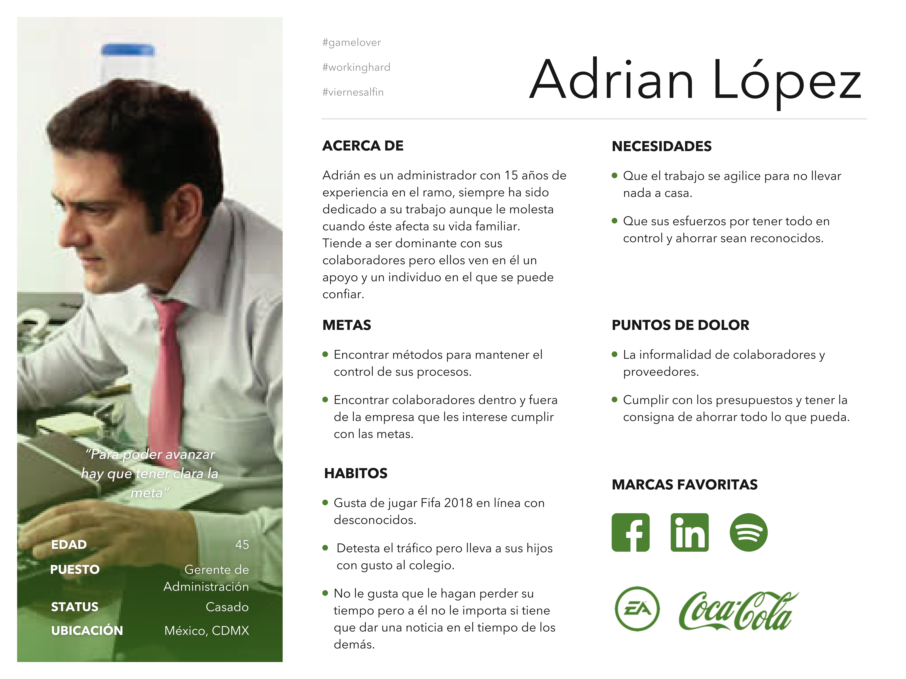

# PROCESO DE DOCUMENTACIÓN E-COMMERCE TONERS REMANUFACTURADOS

## Descubrimiento e investigación

En esta primer etapa identificamos las necesidades de los usuarios y las necesidades del negocio a través de una serie de entrevistas

[Guía para entrevista cliente](https://drive.google.com/open?id=1BBiWblK_G-skLgLjwi8Y0DMxcKxy6ngVk88NWFeVfoQ)

[Guía para entrevista usuarios](https://drive.google.com/open?id=1BGC9VQ6qAvL7ctkC-pfeVFE9OJbSGO1WWB97m8TBoM0)

### Insights Entrevistas Usuarios
* Comprar cartuchos genéricos o remanufacturados reduce en gran porcentaje los costos.
* A pesar de que los cartuchos genéricos o remanufacturados no rinden la misma cantidad de impresiones, es más económico comprar 2 cartuchos que uno original.
* Hemos probado cartuchos remanufacturados y ese cartucho fue el que mayor rendimiento tuvo.
* Tenían el tóner que necesitábamos con entrega inmediata cuando los cartuchos originales tardaban 6 semanas en entregarlo.
* Todas las empresas están buscando actualmente bajar costos de muchas maneras, en este caso en la cantidad de impresiones y la calidad del servicio también debe ser buena.
* Yo creo que cualquier accesorio o pieza que sea remanufacturada siempre y cuando tenga una garantía y veamos que sí funciona el ahorro sería beneficioso en cuanto a la adquisición de esa compra.
* Yo creo que todos es lo que buscamos, como dicen bueno, bonito y barato.
* Hay veces que se necesita la entrega inmediata que es lo que muchos proveedores no cuentan.
* Casi siempre en una empresa urge para el día de ayer, entonces eso es lo que tomaría en cuenta, incluso entrega a deshoras porque hay veces que ses les acaba y tienen que sacar la chamba.

[Transcipción entrevistas usuarios](https://drive.google.com/open?id=1z4isjIAOpzccIR7eaKp34juUJPLZ0YJ0EmEP6tPX20k)

### Insights del Negocio
1.- Comprobamos nuevamente que el fuerte de este negocio es el seguimiento de la venta y la atención personalizada al cliente.

2.- Aunque tienen claro que quieren alcanzar a las grandes oficinas o empresas, y mucho de su esfuerzo va dirigido a ello, hay más probabilidad que por el momento su mercado se limite a negocios pequeños y hogares o freelancers.

3.- Sin embargo el perfil del target es acertado ( oficinas, notarias, consultorios médicos, escuelas, agentes automotrices, agentes de viajes, similares).

4.- La meta para con cliente debe ser generar un ecommerce que los ayude a consolidarse y generar confianza en sus posibles compradores para así hacer más ágil el proceso de ventas.

5.- También recomendamos al cliente que establezca una comunicación profesional en sus redes sociales.

6.- Gracias a su atención personalizada el cliente ha podido descubrir que la mayor falla de su competencia es su inconstancia y pésimo seguimiento al usuario.

[Transcipción Primera Entrevista Cliente](https://drive.google.com/open?id=1mlTGSyEpSw-VhyUcgnF4gmHe79sw2E5XUHoA7j__q9k)

[Transcipción Segunda Entrevista Cliente](https://drive.google.com/open?id=1zw6u3-rAH1aebbUoBz_Rll9cvTUtdL77Mhwh5sW2qDs)

## Búsquedas en la web

#### Qué se entiende por cartuchos originales, compatibles y remanufacturados
> Se entiende por cartuchos compatibles aquellos en los que de todo lo que le compone es totalmente nuevo, incluido carcasas, tornillería y engranajes. Por tanto se trata de un producto nuevo y que tiene un aspecto diferente al del consumible original.
Los cartuchos reciclados, también llamados remanufacturados,  son aquellos que partiendo de  cartuchos originales vacíos son sometidos a un proceso de desmontaje, limpieza, sustitución de componentes, sellado, rellenado, montaje y control final de impresión. Se usan tóner/tinta específicas para cada modelo y todos los componentes mecánicos y eléctricos que desarrollan la impresión previa son sustituidos por componentes totalmente nuevos. Normalmente lo único que se reutiliza son las carcasas exteriores (dependiendo de su estado), tornillería y engranajes.
Un cartucho original es aquel que está fabricado bajo la marca del fabricante original, por tanto lleva su sello y no ha sido fabricado por la marca.

[Compatibles y reciclados VS Originales](http://www.ahorraentinta.com/blog/blog-toner/compatibles-y-reciclados-versus-originales/)

#### Toner original contra compatible
> Muy pocas empresas se preocupan de sustituir las piezas de desgaste de los toners, que las tienen, simplemente rellenan, y claro, luego vienen los problemas.
[Toner original VS toner compatible
](https://www.mur3.com/toner-original-vs-toner-compatible)

#### Infografía HP
[Infografía: descubriendo los problemas del tóner no original
](https://www.muycomputer.com/2015/10/29/infografia-descubriendo-los-problemas-del-toner-no-original/)

### Benchmark comparativo ventajas y desventajas tipos de toner

## Síntesis y definición

### Proceso de creación user persona

Para la creación de nuestro User Persona comenzamos con una lluvia de ideas basado en lo que detectamos en las entrevistas a usuarios, en las que identificamos cuáles son sus necesidades, miedos y deseos.

#### Mapa de empatía

#### User Persona
La persona la construimos con base a las entrevistas con nuestro cliente, por fortuna, y gracias al contacto tan directo que generan con el usuario, nos pudieron dar datos muy coherentes y precisos con rescpecto a quiénes son sus usuarios, cómo se comportan y cuáles son sus paint points.

### Costumer Journey

#### Presentación
[Primera Presentación Cliente](https://drive.google.com/file/d/1mvpoj-8I66E0832WgFmVDeFH1BOkRq7M/view?usp=sharing)
